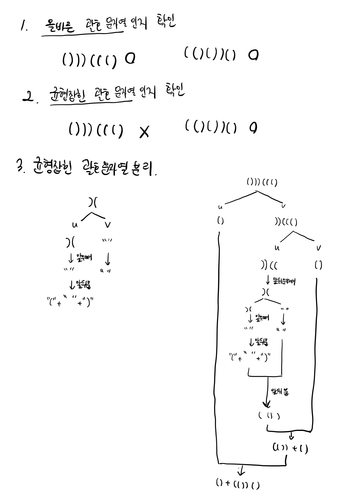

# 60058번 괄호변환
[문제 보러가기](https://programmers.co.kr/learn/courses/30/lessons/60058?language=java)

## 🅰 설계


### 1. 문제에서 주어준 조건에 따라 재귀함수 checkP() 작성
1. 입력이 빈 문자열인 경우, 빈 문자열을 반환
2. 문자열 w를 두 "균형잡힌 괄호 문자열" u와 v로 분리
3. 문자열 u가 "올바른 괄호 문자열" 이라면 문자열 v에 대해 1단계부터 다시 수행
	
	u + checkP(v)
4. 문자열 u가 "올바른 괄호 문자열"이 아니라면,
	1) '(' 와 checkP(v)  그리고  ')' 붙이기, checkP(v)는 문자열 v에 대해 1단계부터 다시 수행하는 것임
	2) u에서 첫 번째와 마지막 문자 제거하고 괄호 뒤집기
```java
public String checkP(String p) {
    // 1. 입력이 빈 문자열인 경우, 빈 문자열을 반환합니다.
    if (p.equals(""))
        return p;
    // 2. 문자열 w를 두 "균형잡힌 괄호 문자열" u, v로 분리합니다.
    int point = findCuttingPoint(p);
    String u = p.substring(0, point);
    String v = p.substring(point, p.length());
    // 3. 문자열 u가 "올바른 괄호 문자열" 이라면
    // 문자열 v에 대해 1단계부터 다시 수행합니다.
    if (isCorrect(u)) {
        return u + checkP(v);
    } else {
        // 4. 문자열 u가 "올바른 괄호 문자열"이 아니라면 아래 과정을 수행합니다.
        // 4-1. 빈 문자열에 첫 번째 문자로 '('를 붙입니다.
        // 4-2. 문자열 v에 대해 1단계부터 재귀적으로 수행한 결과 문자열을 이어 붙입니다.
        // 4-3. ')'를 다시 붙입니다.
        String _v = '(' + checkP(v) + ')';
        // 4-4. u의 첫 번째와 마지막 문자를 제거하고,
        // 나머지 문자열의 괄호 방향을 뒤집어서 뒤에 붙입니다.
        u = u.substring(1,u.length()-1);
        return _v + reverse(u);
    }
}
```
#### findCuttingPoint() : 균형잡힌 문자열 마지막 위치 찾기
주어진 괄호 문자열의 처음부터 맨 뒤까지 순회하며 "균형잡힌 문자열"의 마지막을 찾는다. 이 때  열린 괄호 `(`의 개수와 닫힌 괄호`)`의 개수를 비교하여 그 개수가 같아지는 위치의 인덱스에서 1 을 더한 값을 result에 넣어준다. 
```java
public int findCuttingPoint(String s) {
    int openNum = 0;
    int closeNum = 0;
    int result = -1;
    for (int i = 0; i < s.length(); i++) {
        if (s.charAt(i) == '(')
            ++openNum;
        else if (s.charAt(i) == ')')
            ++closeNum;
        if (openNum == closeNum)
            result = i+1;
    }
    return result;
}
```

#### isCorrect() : 올바른 괄호 문자열 확인
**(1)'(' 의 개수와 ')' 의 개수가 같**고 **(2)'('와 ')'의 괄호의 짝도 모두 맞을 경우**에 올바른 괄호 문자열이라고 한다. 앞서 findCuttingPoint() 함수로 (1) 조건을 만족하는 문자열이기에 (2)의 조건을 확인하면 된다. 변수`count`로 열린 괄호와 닫힌 괄호의 쌍이 맞는지 확인한다.
```java
private boolean isCorrect(String s) {
    int count = 0;
    for (int i = 0; i < s.length(); i++) {
        if (s.charAt(i) == '(')
            ++count;
        else if (s.charAt(i) == ')')
            --count;
        if (count < 0)
            return false;
    }
    return true;
}
```
#### reverse() : 괄호 반대로 뒤집기
```java
public String reverse(String s) {
    StringBuilder sb = new StringBuilder();
    StringBuilder temp;
    for (int i = 0; i < s.length(); i++) {
        temp = (s.charAt(i) == ')')? sb.append('('): sb.append(')');
    }
    return sb.toString();
}
```

## ✅ 후기
### findCuttingPoint 구현 과정
`findCuttingPoint()`에서 처음에 flag 변수`isOpen`으로 도전했었다. 열린 괄호 '('일 때 `true`로 할당하고, `isOpen`이 `true`이면서 닫힌 괄호 ')'일 때 `false`로 할당했었다. 위치 반환은`isOpen`이 `false`이면서 닫힌 괄호 ')'일 때 반환했었다. 이 방식의 가장 큰 문제점은 열린 괄호들이 여러 개 일 때 제대로 처리하지 못했다. 예로 `((()))`일 때  `(())`와 `))`로 분리되어 제대로 처리하지 못했다. 그래서 문제를 다시 읽으며 **균형잡힌 괄호 문자열**이 무엇인지 다시 한번 읽어보았다. 균형잡힌 괄호 문자열은 **열린 괄호 (와 닫힌 괄호)의 개수가 동일한 문자열** 으로 명시되어 있었다. 그래서 괄호문자열을 순회할 때 열린 괄호의 개수를 세는 `openNum`와 닫힌 괄호의 개수를 세는 `closeNum`을 세어 `openNum`과 `closeNum`이 동일할 때의 위치를 반환했다.

### reverse 구현 전에 했던 실수
처음에는 문자열 u를 첫 번째와 마지막 문자를 자른 문자열 `u.substring(1,u.length()-1)`을 stringbuilder에 넣어 stringbuilder의 `reverse`함수를 썼었다. 하지만 이 방식의 문제점은 **현재 괄호를 뒤집는다**가 아닌 **괄호 문자열 u를 뒤집는다**가 되어버리는 것이다. 따라서 `reverse()`함수를 따로 작성하여 괄혼문자열을 순회하며 괄호를 하나씩 뒤집었다.

### 재귀함수의 낯설음
문제 조건에 재귀함수를 이용하라는 것이 없었다면 재귀로 접근하지 못했을 것 같다. 재귀문제를 더 풀어서 유형을 익혀봐야겠다!


