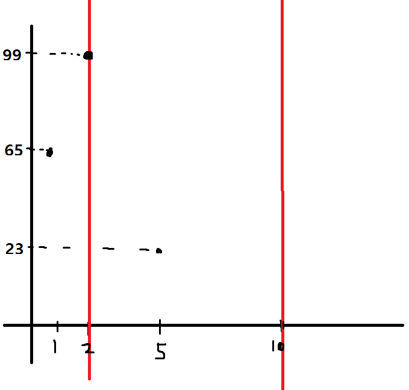

# 1202번 보석 도둑
[문제 보러가기](https://www.acmicpc.net/problem/1202)

## 🅰 설계

일단 그림을 그려서 이해해보려고 했습니다.  
  
무게를 x축, 가치를 y축으로 보면 위와 같은 그림을 만들 수 있습니다.  

처음에 떠오른건 세그먼트 트리였으나.. 구현도 귀찮고 까먹어서 다른 방법을 생각했습니다.  

가방을 오름차순으로 정렬하면 그보다 무게가 작은 보석은 모두 꺼낼 수 있고, 그 중에서 가치가 가장 큰 보석을 찾아서 가방에 담으면 됩니다.  

이를 그대로 코드로 구현하기만 하면 됩니다.  

### 1. 입력-소팅
```java
List<jewelry> jewelries = new ArrayList<>();
for(int i=0;i<n;i++) {
	st = new StringTokenizer(br.readLine());
	jewelries.add(new jewelry(Integer.parseInt(st.nextToken()),Integer.parseInt(st.nextToken())));
	
}

Collections.sort(jewelries);
int[] ks = new int[k];
for(int i=0;i<k;i++) {
	ks[i] = Integer.parseInt(br.readLine());
}

Arrays.sort(ks);
```
보석 list와 가방 array를 오름차순으로 정렬합니다.  


### 2. 가방의 무게 제한에 맞춰서 꺼내기
```java
int jsize = jewelries.size();
int jidx = 0;
long ans = 0;
PriorityQueue<jewelry> pq = new PriorityQueue<>((o1,o2) -> o2.y-o1.y);
for(int i=0;i<k;i++) {
	int xlimit = ks[i];
	while(jidx < jsize && jewelries.get(jidx).x <= xlimit) {
		pq.add(jewelries.get(jidx++));
	}
	if(!pq.isEmpty()) ans += pq.poll().y;
}
System.out.println(ans);
```
`PriorityQueue`는 보석의 가치가 큰 보석이 위로 오게 되는 `max heap`입니다.  

가방의 현재 제한 무게를 기준으로 그보다 무게가 작거나 같은 보석을 모두 `PriorityQueue`에 담아둡니다.  

이 작업을 한 후 `PriorityQueue`에서 보석을 꺼내면 그 가방이 담을 수 있는 최고 가치의 보석이 됩니다.  

### 전체코드
```java
import java.io.*;
import java.util.*;

public class Main {
	static BufferedReader br;
	static StringTokenizer st;

	static List<jewelry> jewelries = new ArrayList<>();
	public static void main(String[] args) throws IOException {
		br = new BufferedReader(new InputStreamReader(System.in));
		st = new StringTokenizer(br.readLine());
		
		int n = Integer.parseInt(st.nextToken());
		int k = Integer.parseInt(st.nextToken());
		
		for(int i=0;i<n;i++) {
			st = new StringTokenizer(br.readLine());
			jewelries.add(new jewelry(Integer.parseInt(st.nextToken()),Integer.parseInt(st.nextToken())));
			
		}
		
		Collections.sort(jewelries);
		int[] ks = new int[k];
		for(int i=0;i<k;i++) {
			ks[i] = Integer.parseInt(br.readLine());
		}
		
		Arrays.sort(ks);
		
		int jsize = jewelries.size();
		int jidx = 0;
		long ans = 0;
		PriorityQueue<jewelry> pq = new PriorityQueue<>((o1,o2) -> o2.y-o1.y);
		for(int i=0;i<k;i++) {
			int xlimit = ks[i];
			while(jidx < jsize && jewelries.get(jidx).x <= xlimit) {
				pq.add(jewelries.get(jidx++));
			}
			if(!pq.isEmpty()) ans += pq.poll().y;
		}
		System.out.println(ans);
	}
	
	static class jewelry implements Comparable<jewelry>{
		int x,y;
		public jewelry(int x,int y) {
			this.x = x;
			this.y = y;
		}
		
		@Override
		public int compareTo(jewelry o) {
			return this.x - o.x;
		}
		
	}
}
```

## ✅ 후기
xlimit 에 `<=`를 `<`로 써서 한번, ans가 int범위를 초과해서 또 틀렸네요.. 좀 더 생각해보고 답을 제출하는 공부를 해야 할것 같습니다.
