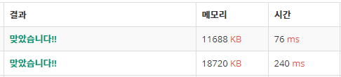

# 16166번 서울의 지하철
[문제 보러가기](https://www.acmicpc.net/problem/16166)

## 🅰 설계
어떤 역에서 환승 없이 갈 수 있는 역들을 하나의 정점으로 만들어버리면 간단한 BFS문제로 변합니다.  

그 전에 해야할 작업들이 있습니다.  

### 1. 좌표 압축  
제가 하고싶은 작업은 각 지하철 역 번호에 `path` 리스트를 만들어 주는 것이었습니다.  

이 `path`에는 해당 지하철 역 번호에서 환승 없이 갈 수 있는 모든 역의 번호들이 들어갈겁니다.  

역의 번호가 최대 `2^31-1`까지 있기 때문에 그냥 입력받는 번호들을 인덱스로 사용하면 낭비가 굉장히 심할겁니다.. (아니면 `path` 리스트와 `visit`도 `HashMap`으로 만들어 줄 수도 있겠네요)  

그러나 우리가 실제로 사용할 번호의 개수는 N\*K = 100개밖에 되지 않습니다.  

따라서 최대 100번까지 새롭게 지하철 역 번호를 부여하였습니다.  

```java
for(int j=0;j<k;j++) {
	int curnum = Integer.parseInt(st.nextToken());
	if(convertIdx.containsKey(curnum)) { // 이미 역의 번호가 부여됨
		sameLine[j] = convertIdx.get(curnum);
		continue;
	}
	convertIdx.put(curnum, idx); // 번호가 부여되지 않았다면 번호 부여
	sameLine[j] = idx; // 같은 호선에 있는 역의 번호들이 담긴 배열
	path[idx++] = new ArrayList<Integer>(); // 그 번호의 path 리스트 생성
}
```

`converIdx`는 지하철 역의 번호를 `key`로 받아 이미 부여한 번호가 존재하면 그 번호로 바꿔주는 `HashMap`입니다.  

`convertIdx.containsKey(curnum)`을 통해 부여된 번호가 있는지 확인하고, 이미 부여된 번호가 있다면 단순히 `sameLine`이라는 배열에 부여된 새로운 번호를 넣어줍니다.  

이렇게 좌표 압축을 한 다음, `sameLine`을 통해 각 지하철 역 번호들에서 환승 없이 갈 수 있는 역들을 담은 `path` 리스트를 만들어 줄 겁니다.  

### 2. path 리스트 만들기  
`path` 리스트에는 해당 정점에서 갈 수 있는 모든 역의 새롭게 부여된 번호들이 들어갑니다.  

```java
static void buildPath() {
	for(int i=0;i<k;i++) {
		int curp = sameLine[i];
		for(int j=0;j<k;j++) {
			path[curp].add(sameLine[j]);
		}
	}
}
```

위에서 `sameLine`에 같은 호선에 존재하는 지하철 역 번호를 모두 넣어줬습니다.  

이 `sameLine`을 이용해서 해당 역 번호에서 갈 수 있는 역의 번호들을 `path`에 모두 넣으면 됩니다.  

`buildPath`를 통해서 해당 정점에서 환승 없이 갈 수 있는 모든 역의 번호를 가지고 있는 `path`리스트를 만들게 됩니다.  

### 3. BFS

이제 위에서 작업한 정보들을 이용해서 BFS를 돌리기만 하면 됩니다.  

```java
int dest = convertIdx.get(Integer.parseInt(br.readLine()));
int start = convertIdx.get(0);

for(int nxt : path[start]) {
	q.add(nxt);
	visit[nxt] = true;
}
int step = 0;
while(!q.isEmpty()) {
	int size = q.size();
	while(size-- > 0) {
		int cur = q.poll();
		if(cur == dest) {
			return step;
		}
		
		for(int nxt : path[cur]) {
			if(visit[nxt]) continue;
			q.add(nxt);
			visit[nxt] = true;
		}
	}
	
	step++;
}

return -1;
```

`start`는 0번이 아닌 `convertIdx`에서 받아온 번호가 됩니다.  

`start` 번호에서 갈 수 있는 모든 역이 시작점이 되어 BFS로 탐색하게 됩니다.  

이렇게 BFS를 통해서 `dest`에 도달하면 바로 `step`을 리턴하게 되고, `dest`에 도달하지 못하면 -1을 리턴하게 됩니다.  

### 4. 기타 실험

이 문제로 여러가지 실험을 해봤습니다.  

#### 4-1. Arrays.stream vs StringTokenizer

- Arrays.stream로 입력 받기
```java
for(int i=0;i<n;i++){
	int[] arr = Arrays.stream(br.readLine().split(" ")).mapToInt(Integer::parseInt).toArray();
	k = arr[0];

	for(int j=1;j<=k;j++) {
		int curnum = arr[j];
	//...
```

- StringTokenizer로 입력 받기
```java
for(int i=0;i<n;i++) {
	st = new StringTokenizer(br.readLine());
	k = Integer.parseInt(st.nextToken());
	
	for(int j=0;j<k;j++) {
		int curnum = Integer.parseInt(st.nextToken());
	//...
```

개인적으로 항상 `StringTokenizer`를 이용해서 입력 받는것이 마음에 안들어서 검색해서 `Arrays.stream`으로 입력 받는 방법을 써봤는데 성능의 차이가 심하네요.  

  

당연한 걸까요.. 굳이 `int[]` 배열을 만들어 버렸으니.. 그냥 하던대로 해야겠습니다.  

#### 4-2. HashSet vs ArrayList  

`path`를 만드는데 처음에는 `HashSet`을 사용했는데, 지하철 번호가 얼마 안되서 `ArrayList`로 중복되는 번호를 넣어도 될 것 같았습니다.  

성능의 차이는 없었지만 `HashSet`을 쓰는게 의미가 맞을것 같습니다.  

#### 4-3. Queue에서 dist값 뽑아내기

제가 처음에 사용했던 방법입니다.
```java
for(int nxt : path[start]) {
	q.add(nxt);
	visit[nxt] = true;
}
int step = 0;
while(!q.isEmpty()) {
	int size = q.size();
	while(size-- > 0) {
		int cur = q.poll();
		if(cur == dest) {
			return step;
		}
		
		for(int nxt : path[cur]) {
			if(visit[nxt]) continue;
			q.add(nxt);
			visit[nxt] = true;
		}
	}
	
	step++;
}
```
따로 `dist`값을 저장하기 위해 class를 만드는게 귀찮아서 `step`을 이용했었습니다.  

다른 사람의 소스를 읽어보니 이런 방법도 사용하더군요  

```java
for(int nxt : path[start]) {
	q.add(nxt); q.add(0);
	visit[nxt] = true;
}
while(!q.isEmpty()) {
	int cur = q.poll();
	int dist = q.poll();
	if(cur == dest) {
		return dist;
	}
	
	for(int nxt : path[cur]) {
		if(visit[nxt]) continue;
		q.add(nxt); q.add(dist+1);
		visit[nxt] = true;
	}
}
```
큐에 번호와 dist를 같이 넣어주고 뺄 때도 같이 빼줍니다.  

실전에서는 뭔가 좀 쓰기 꺼려지는 방법같습니다.. 어떤 실수를 하게될지 모르니까요  

#### 4-4. 쓸데없는 작업 줄이기

문제를 푼 후에 생각해보니 어떤 지하철 역에서 갈 수 있는 `호선들을 담은 HashMap`과 그 호선에서 갈 수 있는 `역을 담은 List`를 만들면 위에서 좌표를 압축하고 `path`를 만드는 작업을 하지 않아도 된다는 것을 깨달았습니다.  

어떤 역에서 갈 수 있는 호선 번호는 `numberLineMap`, 어떤 호선에서 갈 수 있는 역 번호들은 `lineReach`에 저장될겁니다    

- 개선된 코드  

```java
import java.io.*;
import java.util.*;

public class Main {
	static BufferedReader br;
	static StringTokenizer st;

	static HashMap<Integer,List<Integer>> numberLineMap = new HashMap(); // 역 번호를 인덱스로 사용할수 없어서 Map으로 저장, 해당 역에서 갈 수 있는 호선 리스트
	static List<Integer>[] lineReach = new List[11]; // 해당 호선에서 갈 수 있는 역 번호 리스트
	static Queue<Integer> q = new ArrayDeque();
	static boolean[] visit = new boolean[11];
	
	public static void main(String[] args) throws IOException {
		System.out.println(solve());
	}
	
	static int solve() throws IOException {
		br = new BufferedReader(new InputStreamReader(System.in));
		int n = Integer.parseInt(br.readLine());
		
		for(int i=0;i<n;i++) {
			st = new StringTokenizer(br.readLine());
			int k = Integer.parseInt(st.nextToken());
			lineReach[i] = new ArrayList<Integer>(); // 호선 리스트 초기화
			
			for(int j=0;j<k;j++) {
				int curnum = Integer.parseInt(st.nextToken());
				numberLineMap.putIfAbsent(curnum, new ArrayList<Integer>()); // key에 ArrayList가 없었다면 초기화
				numberLineMap.get(curnum).add(i); // 해당 역(curnum)에 호선(i) 추가
				lineReach[i].add(curnum); // 해당 호선(i)에 역(curnum) 추가
			}
		}
		
		int dest = Integer.parseInt(br.readLine());
		int start = 0;

		for(int nxtLine : numberLineMap.get(start)) { // 시작점에서 갈 수 있는 Line들이 queue에 들어감
			q.add(nxtLine);
			visit[nxtLine] = true;
		}
		
		int step = 0;
		while(!q.isEmpty()) {
			int size = q.size();
			
			while(size-- > 0) {
				
				int curLine = q.poll();
				if(lineReach[curLine].contains(dest)) {
					return step;
				}
				
				for(int nxtNum : lineReach[curLine]) {
					for(int nxtLine : numberLineMap.get(nxtNum)) { // 다음으로 갈 수 있는 Line들 탐색
						if(visit[nxtLine]) continue;
						q.add(nxtLine);
						visit[nxtLine] = true;
					}
				}
			}
			step++;
		}
		
		return -1;
	}
}
```


## ✅ 후기

개인적으로 재밌는 문제였고 알게된 것들 정리도 해 볼겸 길게 써봤습니다.  

