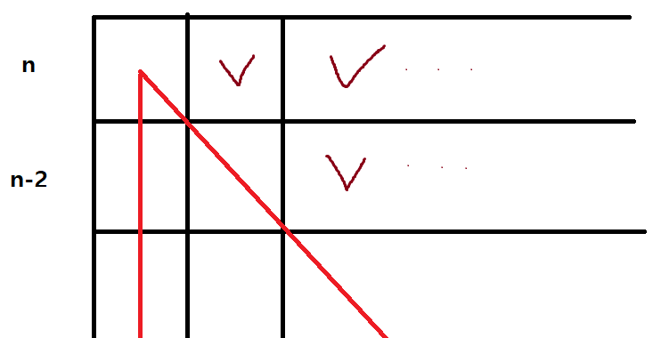

# 9663번 N-Queen
[문제 보러가기](https://www.acmicpc.net/problem/9663)

## 🅰 설계
배경지식이 없는 상태에서 어떻게 풀어나갈지 생각하면서 풀어봤습니다  
체스판 위에 n개의 퀸을 공격할 수 없게 두는 효율적인 알고리즘을 생각해보려 했지만 그런 경우의수를 세는건 너무 어려울 듯 했습니다  
퀸을 두는 모든 경우의 수를 세 보면 n^n이지만, 약간의 체크로 시간복잡도를 비약적으로 줄일 수 있었습니다  
  
대강은 n\*(n-2)\*...으로 계산이 되지만, 확실한 계산이 안되서 이 col,cross 체크 하는 시간을 줄일 필요가 있었습니다. 그냥 for문으로 체크하면 시곤복잡도에 n만큼 곱해질테니까.. 큰 부담이 될겁니다  
row는 사실 다음 행으로 바로 넘어가면 되기 때문에 상관없고, col은 쉽게 O(1)으로 체크가 가능한데.. 대각선 체크는 약간의 아이디어가 더 필요했습니다  
`left to right 대각선`은 row-col또는 col-row를, `right to left 대각선`은 row,col 번호를 더해주면 그 대각선에 유일한 번호를 맞춰줄 수 있었습니다  
단 `left to right 대각선`은 번호가 -까지 가기 때문에, n을 더해주면 -15를 0으로 맞출 수 있기 때문에 최대 31개까지 0-30번 대각선에 번호를 맞춰줄 수 있었습니다  
나머지는 이렇게 체크하는 방법들을 적용하여 완전탐색을 돌리면 됩니다  
```java
import java.io.*;
import java.util.*;

public class Main {
	static BufferedReader br;
	static StringTokenizer st;

	static boolean[] col = new boolean[16], cross1 = new boolean[31], cross2 = new boolean[31]; // col, cross 체크
	static int n,ans;
	public static void main(String[] args) throws IOException {
		br = new BufferedReader(new InputStreamReader(System.in));
		n = Integer.parseInt(br.readLine());

		f(0,0); // 완전탐색 
		System.out.println(ans);
	}
	
	static void f(int r,int c) {
		if(r == n) { // r이 n에 도달하면 모든 row에 queen이 하나씩 세워지므로 경우의 수 +1
			ans++;
			return;
		}
		if(c == n) { // c가 n에 도달하면 해당 row에는 queen이 하나도 없으므로 return
			return;
		}
		
		int chk1 = n+r-c; // left to right 대각선 체크
		int chk2 = r+c; // right to left 대각선 체크
		if(!col[c] && !cross1[chk1] && !cross2[chk2]) {
			col[c] = cross1[chk1] = cross2[chk2] = true;
			f(r+1,0); // 해당 row,col에 queen을 세우고 다음 row를 체크
			col[c] = cross1[chk1] = cross2[chk2] = false;
		}
		f(r,c+1); // 해당 row,col에 queen을 세우지 않고 다음 row,col+1에 넘겨줌
	}
}

```
아래는 위와 완전히 똑같은 방법을 비트마스크로만 옮긴건데.. 0.5초나 차이가 나서 이것도 올려봅니다
```java
import java.io.*;
import java.util.*;

public class Main {
	static BufferedReader br;
	static StringTokenizer st;

	static int n,ans;
	public static void main(String[] args) throws IOException {
		br = new BufferedReader(new InputStreamReader(System.in));
		n = Integer.parseInt(br.readLine());

		f(0,0,0,0,0);
		System.out.println(ans);
	}
	
	static void f(int r,int c,int col,int cross1,int cross2) {
		if(r == n) {
			ans++;
			return;
		}
		if(c == n) {
			return;
		}
		
		int chk1 = (1<<(n+r-c));
		int chk2 = (1<<(r+c));
		int colchk = (1<<c);
		if((col&colchk) == 0 && (cross1&chk1) == 0 && (cross2&chk2) == 0 ) {
			f(r+1,0,col|colchk,cross1|chk1,cross2|chk2);
		}
		f(r,c+1,col,cross1,cross2);
	}
}
```


## ✅ 후기
`f(0,0)`을 `for(int i=0;i<n;i++) f(0,i)`로 해놨었는데 예제 답이 나오지 않아 당황했네요.. 코드 맨 아래 `f(r,c+1)`과 겹쳐서 경우의 수를 더 셌던것 같습니다
백트래킹은 시간복잡도 계산이 힘들어서 이렇게 시간제한이 타이트하다 싶으면 시간을 줄일 수 있는 간단한 방법들은 최대한 많이 사용하는게 좋을것 같습니다
