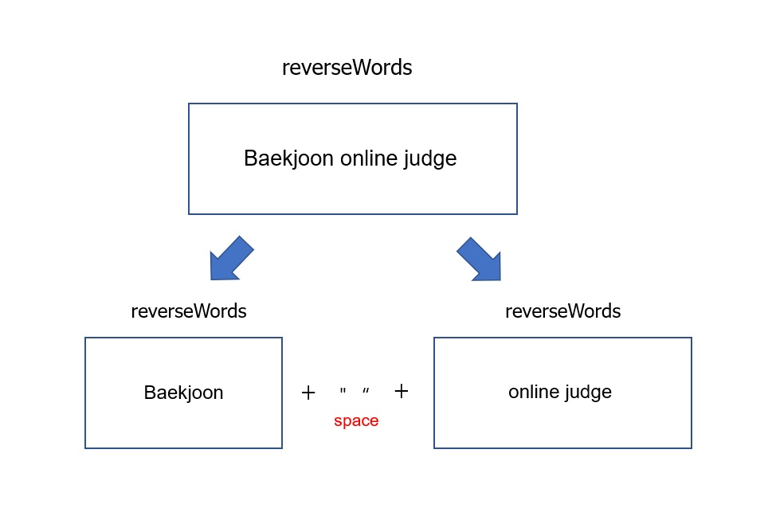
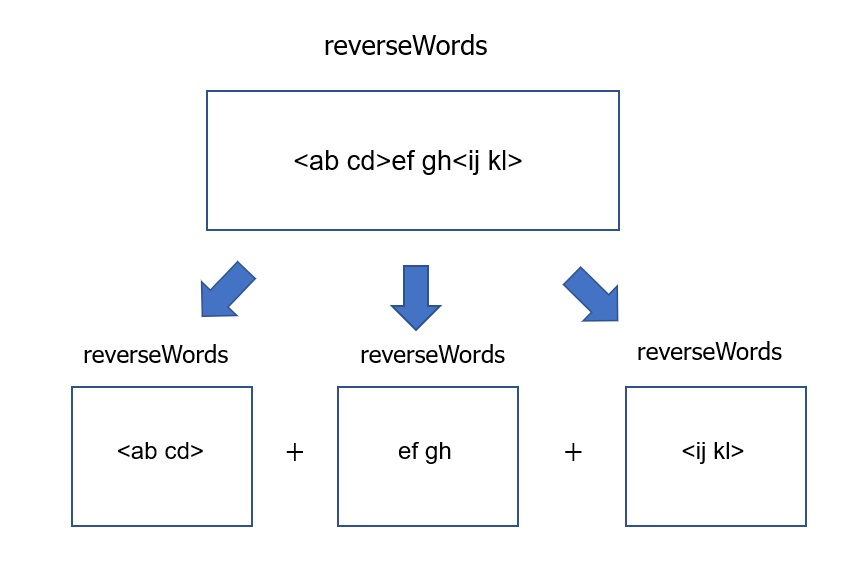

# 17413번 단어 뒤집기 2
[문제 보러가기](https://www.acmicpc.net/problem/17413)

## 🅰 설계
가장 먼저 떠오른건 String 전체를 for문을 돌면서 처리하는 것 이지만 
재귀함수를 연습해보려고 색다르게 구현했습니다.

재귀함수는 문제가 동일한 구성을 가진 Sub-problem으로 분해될 수 있다는 것에 
착안합니다. 이 문제 같은 경우 단어 단위로 문제가 반복됩니다.

<br>



```java 
int idx = input.indexOf(" ");
if(idx == -1) return new StringBuffer(input).reverse().toString();
return new StringBuffer(input.substring(0, idx)).reverse().toString() + " " 
        + reverseWords(input.substring(idx + 1));
```
<br>
단어에 <>가 포함되어 있는 경우 재귀적으로 먼저 처리하여 
<>이 없는 단어들로 분해합니다.

<br>



```java 
int forwardIdx = input.indexOf("<");
if (forwardIdx != -1) {
    int backwardIdx = input.indexOf('>');
    return reverseWords(input.substring(0, forwardIdx)) +
        input.substring(forwardIdx, backwardIdx+1) +
        reverseWords(input.substring(backwardIdx+1));
}
```

## ✅ 후기
요즘 들어 PS에서 재귀함수의 위대함을 많이 느끼고 있습니다. 
이전에는 dfs문제를 풀 때가 아니면 거의 활용하지 못했는데 문제를 동일한 하위
문제로 분해할 수 없을까 잘 고민하면 생각보다 활용도가 무궁무진 한 것 같습니다.
DP를 풀 때에도 바텀업 방식보다 탑다운 방식이 직관적으로 잘 와닿기도 하구요.
사실 반복문 자체가 동일한 작업을 수행하는 일 이기 때문에 언제든지 재귀호출을
할 여지가 있다는 사실을 상기하려고 노력중입니다.